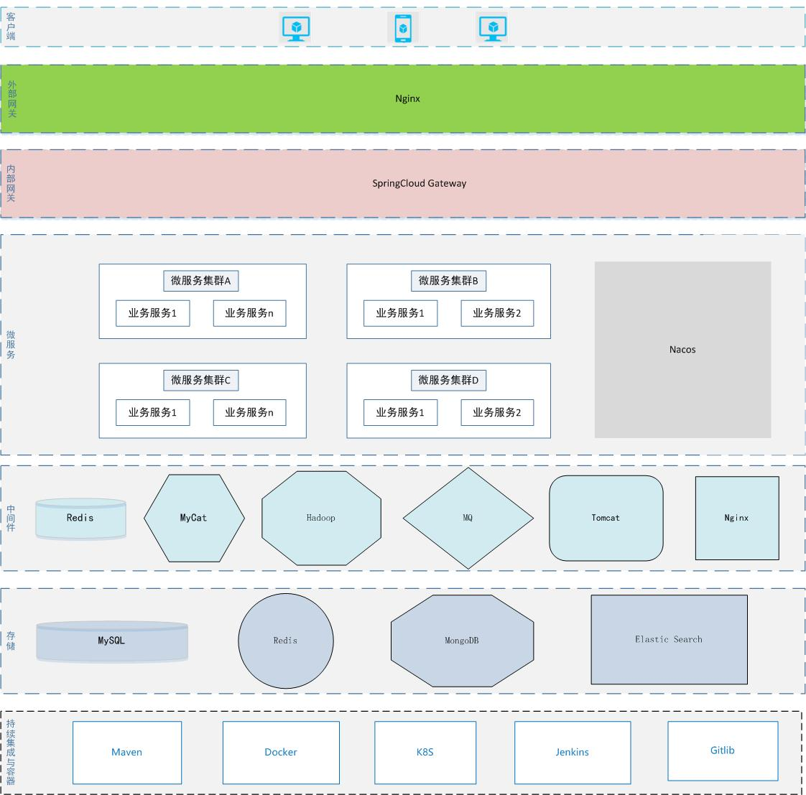

# YC FrameWork

## 一、理念
致力于打造一款优秀的分布式微服务解决方案。

## 二、技术架构


## 三、技术选型
- JDK版本：1.8；
- 项目依赖管理：Maven3.6.2；
- 版本控制工具：Git；
- 分布式框架:SpringCloud+SpringCloud Alibaba；
- 微服务基础框架：SpringBoot；
- 接口鉴权框架：Sa-Token；
- 缓存：Redis；
- 关系型数据库：MySQL；
- 接口文档自动生成框架：Knife4j；
- 持久层框架：MyBatis-Plus；
- 第三方工具类框架：Hutool；
- 数据库连接池：Druid；
- 多数据源框架：dynamic-datasource-spring-boot-starter；
- 限流熔断：Sentinel；
- 分库分表中间件：MyCat；
- 爬虫框架：JSOUP/WebMagic；
- 日志框架：Lombok；
- 服务注册与配置中心：Nacos；
- Excel处理:Apache Poi；
- 分布式定时任务：Quartz；
- 服务链路追踪：SpringCloud Sleuth+Zipkin；
- Word模板引擎：Poi-tl；
- 消息队列：Kafka；
- 大数据存储与计算处理：Hadoop；
- 分布式搜索引擎：Elastic Search；
- 文档数据库：MongoDB。

## 四、系统模块
````   
├── yc-gateway         // 网关服务 [8080]
├── yc-auth            // 认证服务 [8081]
├── yc-api             // 接口服务
├── yc-common          // 通用模块
│       └── yc-common-core                    // 核心模块
│       └── yc-common-knife4j                 // 接口文档自动生成模块
│       └── yc-common-redis                   // Redis模块
│       └── yc-common-security                // 安全模块
│       └── yc-common-elasticsearch           // ElasticSearch模块
│       └── yc-common-mongodb                 // MongoDB模块
│       └── yc-common-rabbitmq                // RabbitMQ模块
│       └── yc-common-activemq                // ActiveMQ模块
│       └── yc-common-kafka                    // Kafka模块
│       └── yc-common-rocketmq                 // RocketMQ日志模块
│       └── yc-common-wx                       // 微信生态模块
│       └── yc-common-crawler                  // 爬虫模块
│       └── yc-common-seata                    // 分布式事务Seata模块
│       └── yc-common-txlcn                    // 分布式事务Tx-LCN模块
│       └── yc-common-quartz                   // 分布式定时任务Quartz模块
│       └── yc-common-xxljob                   // 分布式定时任务xxl-job模块
│       └── yc-common-logstash                 // 分布式日志管理(ELK)模块
│       └── yc-common-pay                      // 第三方支付模块
│       └── yc-common-hadoop                   // 大数据Hadoop模块
│       └── yc-common-flink                    // 分布式计算引擎模块
│       └── yc-common-netty                    // Netty模块
│       └── yc-common-openfeign                // 分布式微服务通信模块
│       └── yc-common-mp                       // MyBatis-Plus模块
│       └── yc-common-linktrack                // 分布式链路追踪模块
│       └── yc-common-cs                       // 对象云存储模块
│       └── yc-common-monitor                  // 微服务监控模块
│       └── yc-common-test                     // 单元测试模块
│                         
├── yc-modules           // 微服务模块
│       └── yc-admin                              // 统一用户微服务 [9000]
│       └── yc-cms                                // 内容管理微服务 [9001]
│       └── yc-crawler                            // 爬虫微服务 [9002]
│       └── yc-file                               // 文件微服务 [9003]
│       └── yc-job                                // 定时任务服务 [9004]
│       └── yc-plugins                            // 插件微服务 [9005]
│       └── yc-wechat                             // 微信生态微服务 [9006]
│       └── yc-monitor-server                     // 监控微服务 [9100]
├──pom.xml                
````

## 五、功能
当前版本所具有的功能如下:

- 用户登录/注册、登录状态、用户信息、退出；
- 微服务接口鉴权模块化；
- 数据爬虫(爬取真气网、博客园、思否、CSDN等网站数据)；
- 用户管理；
- 文章管理；
- 分类管理；
- 标签管理；
- 文件管理；
- 接口文档模块化；
- Sentinel限流熔断；
- 分布式Token；
- 默认集成博客园、聚合等第三方API；
- Redis模块化；
- ElasticSearch模块化；
- 消息队列RabbitMQ模块化;
- MongoDB模块化；
- 消息队列ActiveMQ模块化; 
- 微服务日志模块化(支持MySQL、MongoDB等数据存储仓库)；
- 接口文档网关统一化；
- 微信生态(支持微信公众号、微信支付、微信开放平台、微信小程序、企业号/企业微信等)模块化；
- Admin Server微服务监控模块化；
- 分布式事务Seata模块化；
- 分布式事务Tx-LCN模块化；
- 消息队列Kafka模块化；
- 消息队列RocketMQ模块化；
- 分布式定时任务Xxl-Job模块化；
- 微信生态方案模块化；
- 集成分布式定时任务Elastic-Job；
- Quartz定时任务模块化；
- 爬虫模块化；
- 分布式链路追踪模块化;
- Hadoop模块化；
- 分布式日志管理(ELK)模块化；
- Apache Flink模块化；
- Netty模块化；
- OpenFeign模块化；
- 第三方支付模块化；
- 单元测试模块化；
- MyBatis-Plus模块化；
- 对象云存储模块化。

### 本次版本V1.0.4更新
- 鉴权模块完善角色与菜单；
- 多账号体系构建(支持多端使用、支持多系统使用等)；
- 网关鉴权机制完善；
- 分布式Token完善；
- 分布式日志管理(ELK)模块化；
- 第三方支付模块化；
- Hadoop模块化；
- Flink模块化；
- Netty模块化；
- 爬虫模块化；
- Feign模块化；
- MyBatis-Plus模块化；
- 分布式链路追踪模块化；
- 对象云存储模块化(华为云、阿里云、腾讯云、百度云等兼容与支持)；
- 微服务监控模块化；
- 单元测试模块化。

## 六、环境

### 1.开发环境
- IDE:IntelliJ IDEA 2018.2+版本以上均支持；
- DB:MySQL5.7.x或MySQL8.x版本均支持；
- JDK:1.8；
- Maven: 3.x版本均支持；
- Nacos:1.3.x版本均支持；
- Redis: 5.x版本均支持；
- MongoDB:4.x版本均支持；
- ElasticSearch:7.x版本均支持；
- RabbitMQ:3.x版本均支持；
- ActiveMQ:5.x版本均支持；
- Kafka:2.x版本均支持；
- RocketMQ:4.x版本均支持；
- Seata:1.3.x版本均支持；
- Tx-LCN:5.x版本均支持；
- Xxl-Job:2.x版本均支持；
- Zipkin:2.x版本均支持；
- Elastic-Job:3.x版本支持；
- Hadoop:3.3.1版本支持。
- ELK:7.4.0版本支持。

### 2.服务器部署环境
- DB:MySQL5.7.x或MySQL8.x版本均支持；
- JRE:JRE1.8；
- Nacos:1.3.x版本均支持；
- Redix:5.x版本均支持；
- MongoDB:4.x版本均支持；
- ElasticSearch:7.x版本均支持；
- RabbitMQ:3.x版本均支持；
- ActiveMQ:5.x版本均支持；
- Kafka:2.x版本均支持；
- RocketMQ:4.x版本均支持；
- Seata:1.3.x版本均支持；
- Tx-LCN:5.x版本均支持；
- Xxl-Job:2.x版本均支持；
- Zipkin:2.x版本均支持；
- Elastic-Job:3.x版本支持；
- Hadoop:3.3.1版本支持；
- ELK:7.4.0版本支持；
- 操作系统:Windows Server和Ubuntu、CenOS等均支持。


## 七、项目启动
项目启动顺序分别为:
- yc-gateway；
- yc-auth；
- yc-admin；
- yc-cms；
- yc-crawler；
- yc-file；
- yc-job；
- yc-plugins;
- yc-wechat。

其中涉及数据爬虫相关，必须确保yc-crawler、yc-plugins、yc-job等运行起来才行。

**注意**:
通过爬虫获取的数据只能用于个人学习研究，不能用于任何的商业用途，违反者，后果自负。

## 八、官方文档
文档地址:
http://framework.youcongtech.com/
