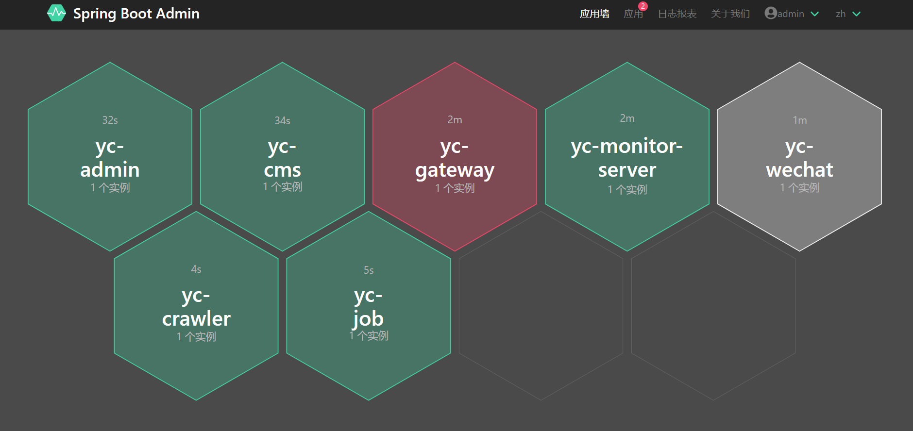

# 微服务监控

## 一、服务端
服务端为yc-monitor-server项目，位于yc-modules下。启动很简单，与启动SpringBoot应用一样。


## 二、客户端
对应的客户端需要引入如下依赖:
```
<dependency>
    <groupId>com.yc.framework</groupId>
    <artifactId>yc-common-monitor</artifactId>
</dependency>

```

## 三、效果图

