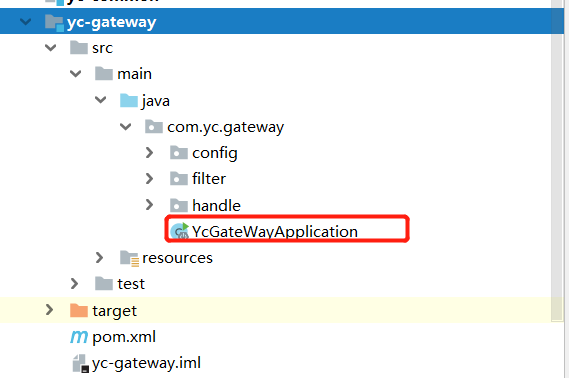
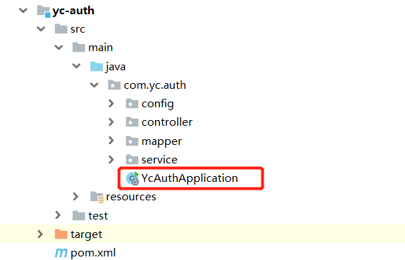
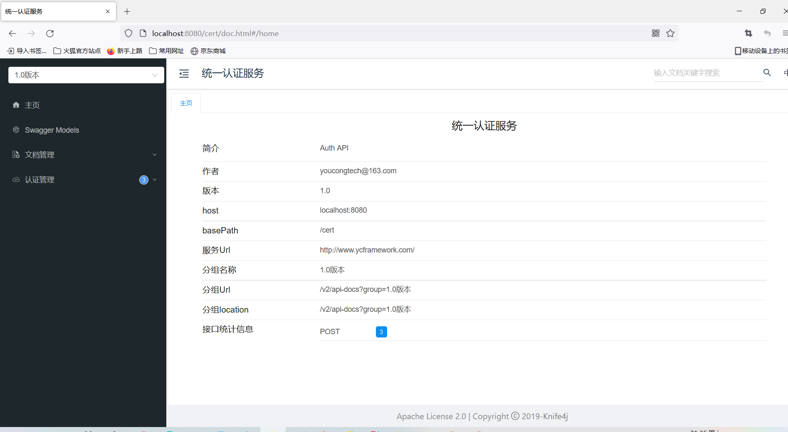
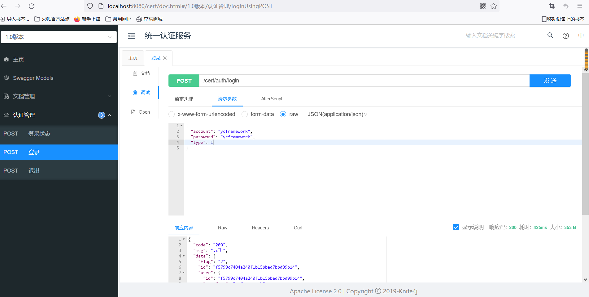
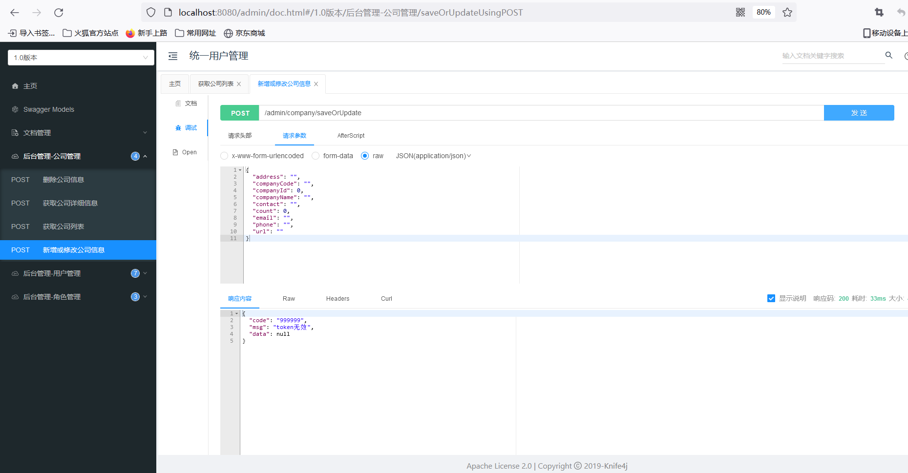

# 项目启动

## 一、启动Nacos
Windows启动步骤:
```
cd nacos/bin
startup.cmd -m standalone

```

Linux启动步骤(Mac同理):
```
cd nacos/bin
bash startup.sh -m standalone或sh startup.sh -m standalone

```

## 二、启动网关


## 三、启动认证服务


## 四、登录测试
访问地址:
http://127.0.0.1/cert/doc.html

效果如下:


测试登录接口:


测试非法访问接口(未登录访问时):


## 五、其它
其它微服务启动就不一一说明了。有问题可在[issues](https://github.com/developers-youcong/yc-framework/issues)反馈。
